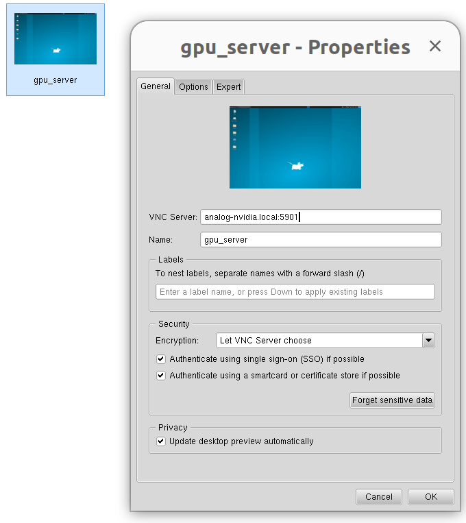
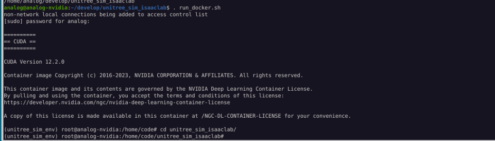
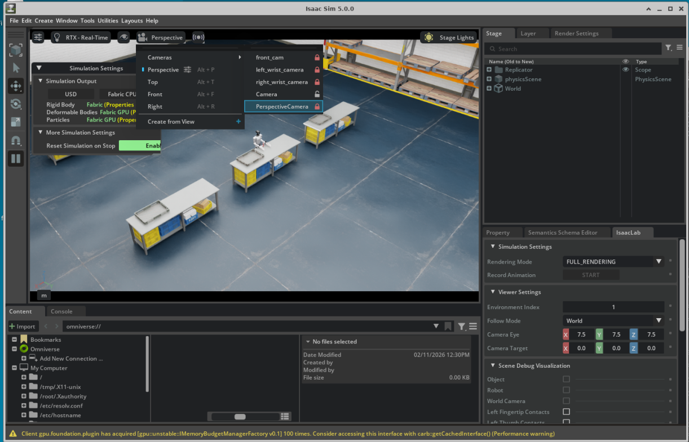
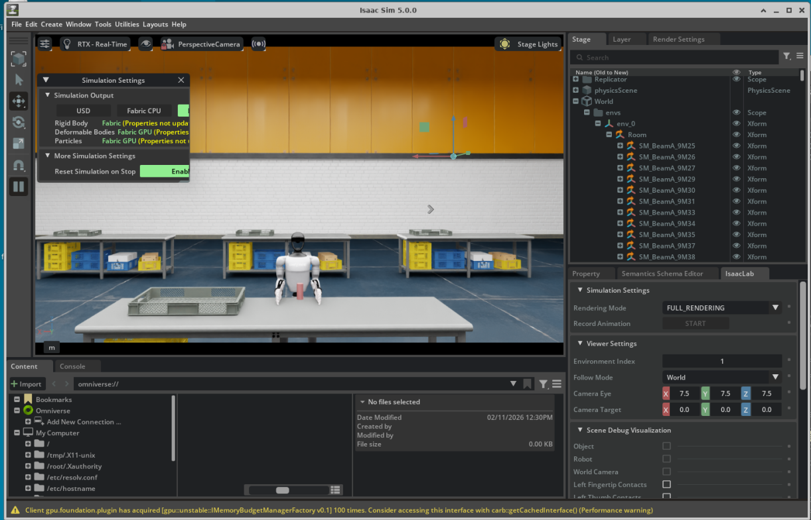
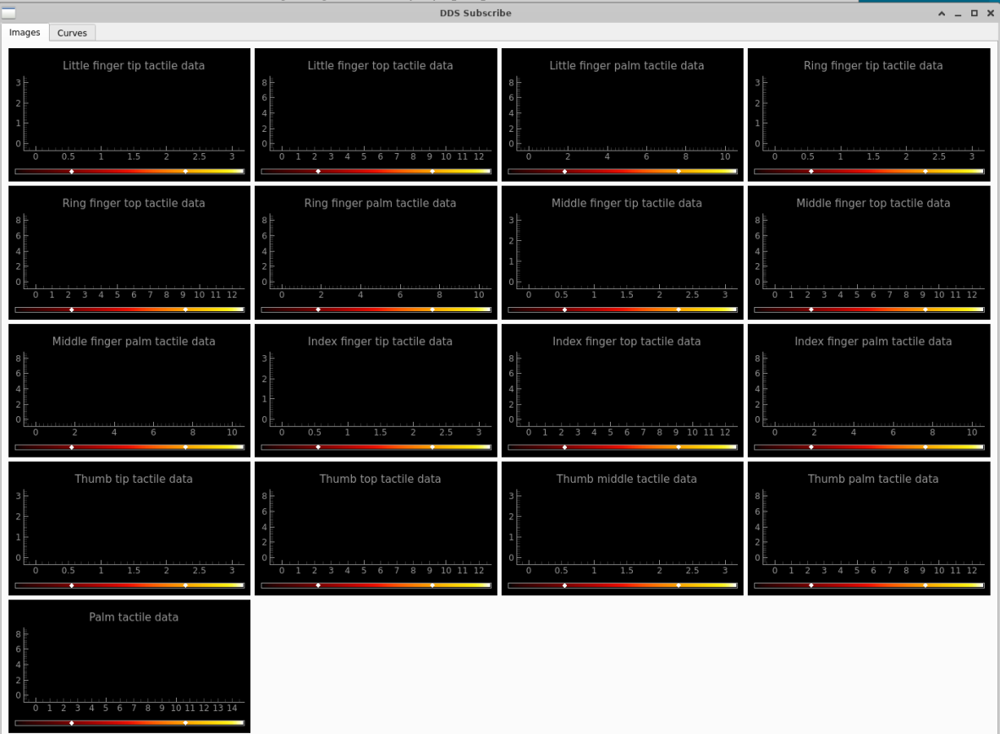
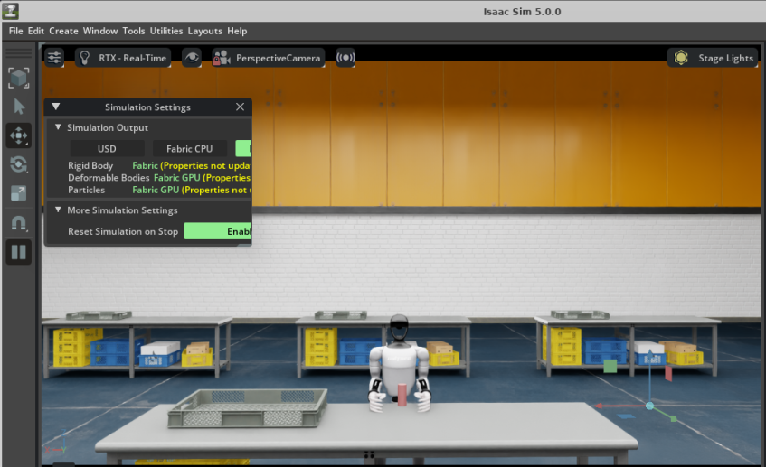
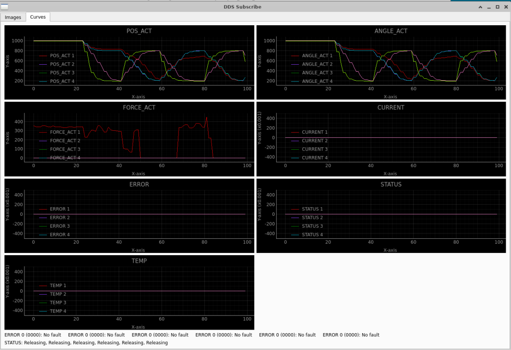
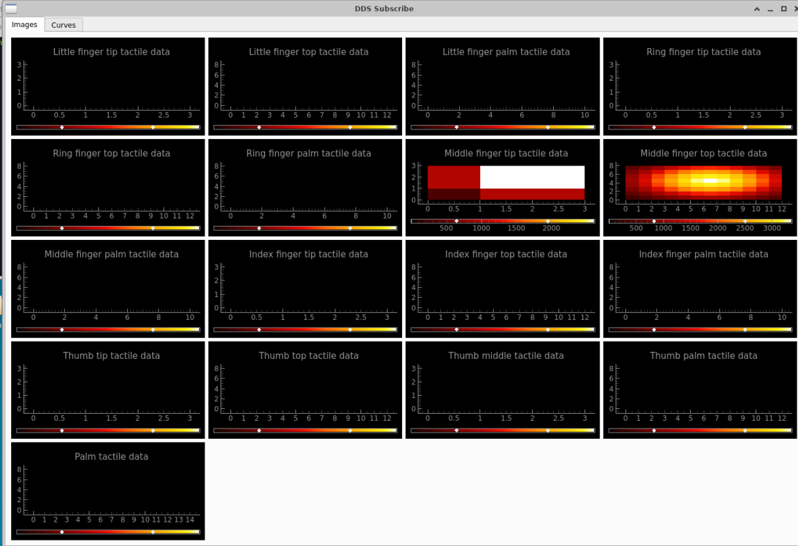

# Inspire Hand Simulation - Quick Start Guide

This guide explains how to run the Isaac Lab simulation with Inspire Hand, send control commands, and visualize sensor data.

## Prerequisites

There is a PC with NVIDIA RTX 4000 Ada Gen GPU with Isaac Sim setup for unitree_sim_isaaclab. Connect to it using a VNC viewer app while connected to the ADI-ROBO-WLAN network.



**Credentials:**
- User: `analog-nvidia`
- Password: `analog`

---

## 1. Directory Structure

Inside the server, enter the `~/develop` directory:

```bash
analog@analog-nvidia:~$ cd ~/develop/
analog@analog-nvidia:~/develop$ ls
inspire_hand_ws  unitree_sim_isaaclab
```

It contains both packages:
- `inspire_hand_ws` - SDK for controlling the real hand (RH56DFTP) and DDS communication
- `unitree_sim_isaaclab` - Unitree Isaac Sim framework

---

## 2. Start the Simulation

### 2.1 Enter Docker Container

```bash
cd ~/develop/unitree_sim_isaaclab
./run_docker.sh
```



### 2.2 Run Simulation (with task setup)

Inside the container:

```bash
cd unitree_sim_isaaclab/
./run_inspire_task.sh
```

Wait for the simulation to start up.



Move to perspective camera for a better view:



The simulation will start and begin publishing DDS data on domain 1.

---

## 3. Run DDS Subscriber and Publisher

Open a new terminal on the host machine.

### 3.1 Start Python Environment

```bash
cd ~/develop/inspire_hand_ws
source venv/bin/activate
```

### 3.2 Run Subscriber

```bash
python inspire_hand_sdk/example/dds_subscribe.py enp0s31f6 r
```

- Uses ethernet interface `enp0s31f6`
- Subscribes to right (`r`) hand topics



### 3.3 Run Publisher

Open another terminal:

```bash
cd ~/develop/inspire_hand_ws
source venv/bin/activate
python inspire_hand_sdk/example/dds_publish.py enp0s31f6
```

Robot receives commands over DDS, moves, and DDS subscriber reads the data.



On the subcriber side, it displays:

- **State data**: `pos_act`, `angle_act`, `force_act`



- **Touch data**: Tactile sensor readings for each finger region



---

## 4. Control Scripts

### 4.1 Simple Hand Control (hands only)

```bash
cd ~/develop/inspire_hand_ws
source venv/bin/activate
python inspire_hand_sdk/example/test_tactile_grasp.py
```

This script:
- Opens hands (angle=900)
- Closes hands gradually (900 → 100)
- Holds grip for observation
- Releases

### 4.2 Arm + Hand Control

```bash
cd ~/develop/inspire_hand_ws
source venv/bin/activate
python inspire_hand_sdk/example/test_arm_grasp.py
```

This script (experimental):
- Moves the right arm toward the cylinder
- Opens hand
- Closes hand to grasp
- Holds grip
- Releases and returns to default pose

### 4.3 Custom Control Commands

```python
#!/usr/bin/env python3
import sys
sys.path.insert(0, "/home/analog/develop/inspire_hand_ws/unitree_sdk2_python")
sys.path.insert(0, "/home/analog/develop/inspire_hand_ws/inspire_hand_sdk")

from unitree_sdk2py.core.channel import ChannelPublisher, ChannelFactoryInitialize
from inspire_sdkpy import inspire_dds, inspire_hand_defaut
import time

# Initialize DDS (domain 1, network interface)
ChannelFactoryInitialize(1, "enp0s31f6")

# Create publishers for both hands
pub_r = ChannelPublisher("rt/inspire_hand/ctrl/r", inspire_dds.inspire_hand_ctrl)
pub_r.Init()
pub_l = ChannelPublisher("rt/inspire_hand/ctrl/l", inspire_dds.inspire_hand_ctrl)
pub_l.Init()

# Create control command
cmd = inspire_hand_defaut.get_inspire_hand_ctrl()
cmd.mode = 0b0001  # Angle control mode

# Set finger angles (0-1000, where 1000=open, 0=closed)
cmd.angle_set = [500, 500, 500, 500, 500, 500]  # Half closed
# Indices: [pinky, ring, middle, index, thumb_bend, thumb_rotation]

# Send command
pub_r.Write(cmd)
pub_l.Write(cmd)
```

### Control Modes

| Mode | Binary | Description |
|------|--------|-------------|
| 1 | `0b0001` | Angle control |
| 4 | `0b0100` | Force control |
| 5 | `0b0101` | Angle + Force control |
| 8 | `0b1000` | Speed control |
| 15 | `0b1111` | All controls |

### Angle Values

| Value | Meaning |
|-------|---------|
| 1000 | Fully open |
| 500 | Half closed |
| 0 | Fully closed |

---

## 5. DDS Topics Reference

| Topic | Type | Direction | Description |
|-------|------|-----------|-------------|
| `rt/inspire_hand/state/r` | `inspire_hand_state` | Sim → Host | Right hand joint state |
| `rt/inspire_hand/state/l` | `inspire_hand_state` | Sim → Host | Left hand joint state |
| `rt/inspire_hand/touch/r` | `inspire_hand_touch` | Sim → Host | Right hand tactile data |
| `rt/inspire_hand/touch/l` | `inspire_hand_touch` | Sim → Host | Left hand tactile data |
| `rt/inspire_hand/ctrl/r` | `inspire_hand_ctrl` | Host → Sim | Right hand commands |
| `rt/inspire_hand/ctrl/l` | `inspire_hand_ctrl` | Host → Sim | Left hand commands |
| `rt/lowcmd` | `LowCmd_` | Host → Sim | Robot arm/body commands |

---

## 6. Arm Control (G1 Robot)

### Joint Indices

| Index | Joint |
|-------|-------|
| 0-14 | Legs and torso |
| 15-21 | Left arm (shoulder_pitch, shoulder_roll, shoulder_yaw, elbow, wrist_roll, wrist_pitch, wrist_yaw) |
| 22-28 | Right arm (same order) |

### Example: Move Right Arm

```python
from unitree_sdk2py.core.channel import ChannelPublisher, ChannelFactoryInitialize
from unitree_sdk2py.idl.unitree_hg.msg.dds_ import LowCmd_, MotorCmd_
from unitree_sdk2py.utils.crc import CRC

ChannelFactoryInitialize(1, "enp0s31f6")
pub_arm = ChannelPublisher("rt/lowcmd", LowCmd_)
pub_arm.Init()
crc = CRC()

def create_arm_cmd(positions):
    motor_cmds = []
    for i in range(35):
        pos = positions[i] if i < len(positions) else 0.0
        motor = MotorCmd_(
            mode=1, q=float(pos), dq=0.0, tau=0.0,
            kp=100.0, kd=10.0, reserve=0
        )
        motor_cmds.append(motor)

    cmd = LowCmd_(
        mode_pr=0, mode_machine=0, motor_cmd=motor_cmds,
        reserve=[0, 0, 0, 0], crc=0
    )
    cmd = LowCmd_(
        mode_pr=cmd.mode_pr, mode_machine=cmd.mode_machine,
        motor_cmd=cmd.motor_cmd, reserve=cmd.reserve,
        crc=crc.Crc(cmd)
    )
    return cmd

# Set right arm position (indices 22-28)
positions = [0.0] * 29
positions[22] = 0.9   # shoulder_pitch
positions[23] = 0.8   # shoulder_roll
positions[24] = 0.4   # shoulder_yaw
positions[25] = 1.3   # elbow
positions[26] = 0.0   # wrist_roll
positions[27] = -0.3  # wrist_pitch
positions[28] = 0.0   # wrist_yaw

cmd = create_arm_cmd(positions)
pub_arm.Write(cmd)
```

---

## 7. Troubleshooting

### No data received

1. Check simulation is running:
   ```bash
   docker ps -a
   ```

2. Verify network interface:
   ```bash
   ip addr | grep enp0s31f6
   ```

3. Check DDS domain matches (should be 1):
   ```python
   ChannelFactoryInitialize(1, "enp0s31f6")  # Domain 1
   ```

### Force/touch always zero

1. Ensure fingers are actually touching the object in simulation
2. Check contact sensors are finding bodies:
   ```bash
   docker logs <container_name> 2>&1 | grep "body names"
   ```

### Hands not moving

1. Verify control commands are being sent (add print statements)
2. Check the simulation is receiving commands:
   ```bash
   docker logs <container_name> 2>&1 | grep "inspire"
   ```

---

## 8. File Locations

| Purpose | Path |
|---------|------|
| Simulation environment config | `unitree_sim_isaaclab/tasks/g1_tasks/pick_place_cylinder_g1_29dof_inspire/` |
| DDS communication | `unitree_sim_isaaclab/dds/inspire_dds.py` |
| State extraction | `unitree_sim_isaaclab/tasks/common_observations/inspire_state.py` |
| Tactile extraction | `unitree_sim_isaaclab/tasks/common_observations/inspire_tactile.py` |
| Test scripts | `inspire_hand_ws/inspire_hand_sdk/example/test_*.py` |
| Inspire SDK | `inspire_hand_ws/inspire_hand_sdk/` |

---

## 9. Quick Test Sequence

```bash
# Terminal 1: Start simulation
cd ~/develop/unitree_sim_isaaclab && ./run_docker.sh
# Inside container:
cd unitree_sim_isaaclab && ./run_inspire_task.sh

# Terminal 2: Subscribe to data
cd ~/develop/inspire_hand_ws
source venv/bin/activate
python inspire_hand_sdk/example/dds_subscribe.py enp0s31f6 r

# Terminal 3: Send control commands
cd ~/develop/inspire_hand_ws
source venv/bin/activate
python inspire_hand_sdk/example/dds_publish.py enp0s31f6
```

Watch Terminal 2 for force and touch values as the hand moves.
